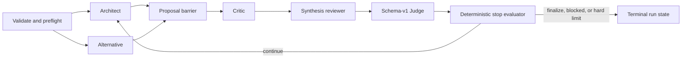

# Architecture

Agent Debate Engine is a small local orchestrator for structured, auditable discussions between
command-line coding agents. It is not a general agent framework, a distributed scheduler, or an
operating-system sandbox.

## Design goals

- Preserve debate dependencies: proposals precede critique, critique precedes revision, and
  revision precedes judgment.
- Run independent work concurrently without allowing a later stage to observe a partial earlier
  stage.
- Keep provider integration explicit, contract-specific, and free of shell interpolation. Version
  probing is restricted to allowlisted built-in provider contracts.
- Bound rounds, elapsed time, prompt growth, process output, retries, and concurrency.
- Preserve enough evidence to explain success, failure, and resume decisions.
- Separate a model's recommendation from the deterministic decision to stop.
- Default to analysis-only provider modes and require deliberate escalation for broader
  permissions.

## Execution model

A workflow is a linear sequence of stages. The list order is a dependency contract. A stage can run
its participants in parallel or sequentially; either way, the next stage starts only after the
current stage reaches its barrier.

The generated workflow uses two parallel proposals followed by one critic and one synthesis
reviewer. That is five model calls per round including the Judge. It may finalize after one
well-supported round and is capped at three by default. Higher-assurance deployments can increase
`min_rounds` and `stable_rounds`, accepting the extra latency and model cost.

Parallel results are persisted under participant IDs and presented to later stages in deterministic
workflow order, not completion order. `run.max_parallel` is the global concurrency ceiling.

## Components

### Natural-language control plane

The repository-owned `agent-debate` Skill is a thin conversational adapter rather than a second
orchestrator. It selects the safe technical-review preset, writes task content to a file instead of
process argv, invokes `agent_debate.skill_runner`, and interprets one structured JSON envelope.
The runner calls the public engine API directly, so it never parses Rich terminal text or guesses
the newest run directory.

`agent_debate.presets.build_technical_review_config()` owns the versioned default workflow used by
the Skill. It exposes only read-only Codex roles and bounded `quick`, `standard`, and `deep`
budgets. Custom providers and permissions stay on the explicit YAML path.

### Configuration

The configuration loader validates schema v1, rejects unknown fields, resolves relative paths
against the YAML file, and checks cross-references between agents, participants, prompts, and the
Judge. The loaded configuration is immutable input to a run and is snapshotted into the run
directory.

### Orchestrator

The orchestrator owns round and stage ordering, the concurrency limit, failure policy, retries,
context construction, Judge invocation, stopping, and terminal state. Provider adapters never
decide workflow order or convergence.

### Provider adapters

Adapters translate a typed invocation into an argv list and launch a subprocess without
`shell=True`.

- Codex receives prompts on stdin and uses a fixed `codex exec` contract. The adapter owns
  approvals, sandbox, workspace, model, structured output, and final-output flags and rejects
  configuration/profile/feature or other arguments that could override those controls.
- Kimi 0.29.1 receives prompts through `--prompt`; its adapter enforces a conservative byte limit
  and redacts the prompt in displayed argv. Headless prompt mode creates or resumes a session with
  permission `auto` and auto-approves tools, so the adapter supports only `danger_full_access` with
  the engine's two-part unsafe acknowledgement. Prompt, output-format, permission-mode, model, and
  directory controls are adapter-owned.
- Generic commands support explicitly configured stdin, positional-argument, or flag transport,
  but expose no portable sandbox contract. Every generic profile therefore requires the runtime
  unsafe acknowledgement regardless of its declared permission and is forbidden in a parallel
  stage.

Adapters normalize exit status, timeout, stdout, stderr, final response, and timing metadata. They
enforce independent transport and authoritative-final-output limits and do not infer that a
non-empty response is a successful Judge decision. Transport overflow remains a strict failure
when stdout is authoritative. When Codex writes a separate managed final artifact, the supervisor
continues draining its JSON event stream after the capture budget is full, discards further
transport text, and records both the truncation and total observed character count. The bounded
final artifact still determines success and remains subject to its own strict limit. Legacy
configurations that omit the final limit inherit their transport limit.
Codex-managed final output is staged below the engine's private POSIX state root, which must be
disjoint from the workspace and system temporary directory. The adapter accepts only a stable,
regular, single-link output file, then copies validated text into canonical run artifacts and
removes the per-invocation directory. This separates output from `read_only` and `workspace_write`
model-tool roots; it cannot contain a `danger_full_access` provider.

Models are not hardcoded in the template. Omitting `model` delegates model selection to each CLI's
local configuration. A deployment that needs a pinned model can set it explicitly, but must then
own alias availability and version drift.

The local compatibility checks for this implementation used `codex-cli 0.145.0` and `kimi 0.29.1`.
They covered CLI output and the installed Kimi bundle's headless permission behavior; they are not
a claim that every earlier or later CLI version behaves identically. Preflight fails closed when a
built-in product/version leaves its verified contract. Generic preflight never executes the
configured command and therefore reports no version.

### Context builder

The context builder labels prior evidence with stable identifiers such as
`R2:critique:critic`. It preserves the task, role, Judge ledger, open issues, next-round focus,
current-round outputs, and a bounded number of recent rounds. Budgets prevent unbounded prompt and
response accumulation.

Task text, repository material, prompts, and model output are all treated as untrusted content.
Stable labels improve traceability; they do not make the labeled claim true.

### Judge protocol

The Judge emits schema v1. The parser accepts a plain JSON object, one whole-response JSON fence,
or one unambiguous object surrounded by noise. Zero or multiple candidate objects, extra fields,
wrong types, or semantic violations are protocol failures. At most one configured schema-repair
attempt is allowed.

The Judge reports a verdict and evidence-backed synthesis. It does not own the terminal state.
Only a successfully parsed and semantically validated Judge decision is added to the ordered Judge
index and becomes a completed-round barrier. Raw output from an invalid or exhausted repair
attempt remains in its immutable invocation artifacts, but no `decision.json` checkpoint is
created.

### Deterministic stop evaluator

The evaluator applies hard limits first. `blocked` stops immediately. A soft `finalize` succeeds
only after:

- `min_rounds` has been reached;
- confidence meets `confidence_threshold`;
- no critical unresolved issue remains; and
- the required number of consecutive qualifying decisions reaches `stable_rounds`.

Elapsed-time and round limits terminate independently of model confidence. A `continue` verdict at
the final round becomes `exhausted`, not a fabricated consensus.

### Artifact store

Every invocation has a private, uniquely identified artifact directory containing its request, raw
streams, final response, metadata, and content hashes. Invocation directories are append-only:
retries and resumed incomplete rounds get new IDs and never replace prior attempts. A manifest
assigns them a locked, monotonic total order and summarizes the run, while an append-only JSONL
event stream records state transitions. On reconstruction, the newest attempt supersedes earlier
attempts before status filtering, so a later failure cannot resurrect discarded success. Replacement
writes use a temporary file, `fsync`, `os.replace`, and a parent-directory `fsync` where supported.
All canonical reads and writes are relative to the stable run-directory descriptor, so replacing
the visible directory cannot redirect the active writer.

Resume acquires a non-blocking exclusive run lock before trusting any manifest-selected path. It
then validates the exact schema-v1 manifest, fixed root pointers, safe relative paths, ordered
indexes, all recorded artifact hashes, index-to-metadata links, and event sequence/digests.
Lifecycle eligibility and schema-valid Judge barriers are checked before the configuration can
select external prompt or workspace paths. Only after those checks may the orchestrator load the
configuration snapshot, perform provider preflight, record the resume transition, and start new
work. See [run-format.md](run-format.md) for the on-disk protocol.

## Failure semantics

Failures are data, not missing text:

- spawn errors, non-zero exits, timeouts, and output overflow become typed invocation failures;
- stage behavior follows `failure.on_agent_error` and `require_all_participants`;
- malformed Judge output follows `on_judge_error` and `schema_repair_attempts`;
- required context that cannot fit its budget fails explicitly;
- a locked, corrupt, or incompatible run is not resumed.

The manifest and event log retain partial progress. Cumulative elapsed time is checkpointed with
each completed invocation, round transition, controlled failure, and accepted resume preflight, so
repeated resume cannot reset completed work. A hard kill during an active provider call can lose
that uncheckpointed fraction; an external supervisor is required for a deadline that must survive
process or host termination.

On supported POSIX systems, each subprocess runs in a dedicated process group. Timeout,
cancellation, output overflow, and residual descendants trigger bounded TERM/KILL cleanup.
Residual descendants normally make the invocation fail. A successful Codex invocation with a
managed final-output artifact may continue only after that cleanup succeeds, because Codex can
leave short-lived helper processes behind after its leader exits. This is best-effort supervision
rather than an OS sandbox: a hostile process may deliberately escape its process group. Unsafe
providers still require external containment such as a container, VM, or restricted account.

## Deliberate boundaries

Version 0.1 does not provide distributed workers, a web UI, an Agent OS, arbitrary DAGs,
cross-agent shared write access, or a general secret broker. It also does not offer Kimi as a
read-only provider: Kimi 0.29.1 headless prompts auto-approve tools. These exclusions keep the core
state machine, trust boundaries, and run format reviewable before broader execution authority is
added.

Version 0.1 officially supports POSIX platforms only (Linux and macOS). Windows is not supported
because the release contract depends on POSIX process groups, advisory file locking, private modes,
and directory durability behavior.
